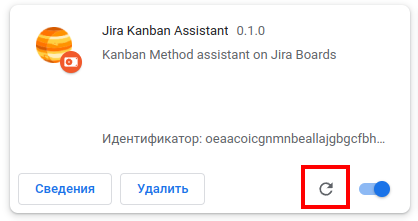

# Jira Kanban Assistant

Это плагин для Google Chrome чтобы смотреть статистику канбана по любой kanban-доске в Atlassian Jira.

## Установка

У вас должен быть установлен git или любой его клиент. Для Windows можно использовать https://tortoisegit.org/

Переходим в каталог, где будете держать плагин.
Там выполняете 
```bash
git clone https://github.com/tsergey-tm/jira-kanban-assistant-dist.git
``` 
Или через клиента получаете файлы из https://github.com/tsergey-tm/jira-kanban-assistant-dist.git 

После этого заходим в хроме в [chrome://extensions/](chrome://extensions/).

Там включаем режим разработчика:


Нажимаем "Загрузить распакованное расширение" и указываем каталог jira-kanban-assistant-dist.

## Обновление

Для обновления надо перейти в каталог jira-kanban-assistant-dist 
и выполнить команду pull в клиенте
```bash
git pull
```

После этого заходим в хроме в [chrome://extensions/](chrome://extensions/) 
и на плагине Jira Kanban Assistant нажимаем кнопку обновления: 



## Запуск плагина

Перейдите на вашу доску и в списке плагинов ннажмите на иконку .
Если доска будет опознана плагином, то в выпадающем окне появится кнопка, 
чтобы открыть окно со статистикой. 
